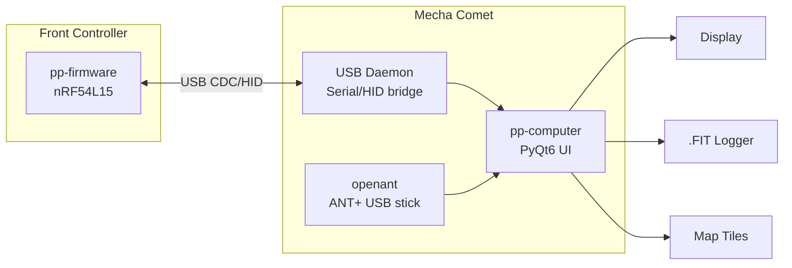
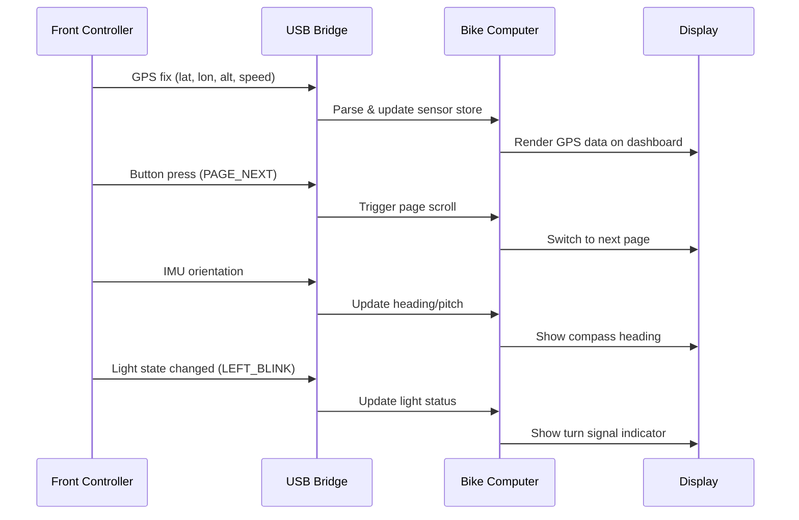

# pp-computer

Bike computer software for the PedalPirat platform, running on the Mecha Comet Linux handheld.

## Overview

Fork/adaptation of [pizero_bikecomputer](https://github.com/hishizuka/pizero_bikecomputer) for the Mecha Comet, with added USB integration to the PedalPirat front controller for sensor data, button input, and system control.

## Architecture



## Features

### From pizero_bikecomputer (upstream)
- GPS track recording & .FIT export
- ANT+ sensor display (HR, power, speed, cadence)
- Map display with offline tiles
- Course navigation
- Multiple display support

### PedalPirat Additions
- **USB bridge to front controller** — receive sensor data (GPS, IMU, speed)
- **Button forwarding** — front controller buttons control bike computer pages
- **Light status dashboard** — show turn signal, headlight, brake state
- **Gear display** — current Rohloff gear from rear controller via CAN→USB
- **Power budget** — Forumslader charge state, power consumption
- **Camera feed** — E2IP AI camera object detection overlay (future)

## Data Flow



## Directory Structure

```
pp-computer/
├── modules/
│   ├── sensor/
│   │   ├── usb/              # USB bridge to front controller
│   │   │   ├── usb_serial.py
│   │   │   └── protocol.py  # Message parsing (from nRF54L15)
│   │   ├── ant/              # ANT+ sensors (via openant)
│   │   └── ...               # Inherited from pizero_bikecomputer
│   ├── display/              # Display drivers (adapted for Mecha Comet)
│   ├── dashboard/
│   │   ├── light_status.py   # Turn signal / headlight indicators
│   │   ├── gear_display.py   # Current gear visualization
│   │   └── power_budget.py   # Forumslader state
│   └── ...
├── layouts/                  # UI layout definitions
├── scripts/                  # Setup scripts for Mecha Comet
├── config/                   # Default configuration
└── docs/
    ├── mecha-comet-setup.md  # Hardware setup on Mecha Comet
    └── usb-protocol.md       # USB message format documentation
```

## USB Protocol (TBD)

Communication between front controller and Mecha Comet. Options under consideration:

| Approach | Pros | Cons |
|---|---|---|
| USB CDC (serial) | Simple, well-supported | Need custom protocol parser |
| USB HID (keyboard) | Native button support | Limited for sensor data |
| USB composite (CDC + HID) | Best of both worlds | More complex firmware |

Decision deferred — will prototype with USB CDC first.

## Dependencies

- [pizero_bikecomputer](https://github.com/hishizuka/pizero_bikecomputer) (upstream)
- [openant](../openant/) (ANT+ USB stick support)
- PyQt6
- pyserial (for USB CDC)

## Target Platform

- **Hardware:** [Mecha Comet](https://developers.mecha.so/comet/) Linux handheld
- **OS:** Linux (Mecha OS / Debian-based)
- **Display:** Mecha Comet built-in display
- **Connectivity:** USB-C to front controller, USB ANT+ stick

## License

TBD (upstream is MIT)
